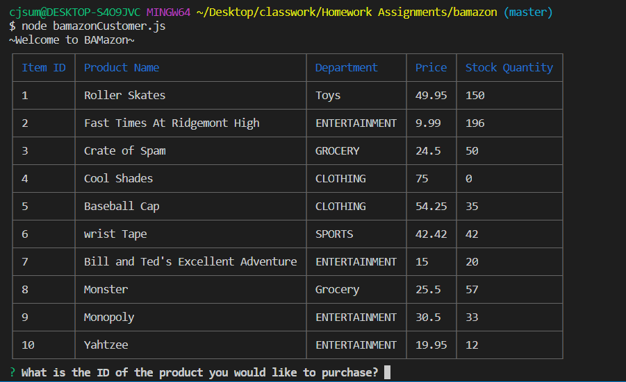
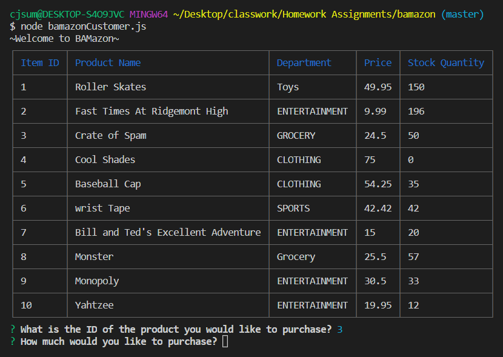
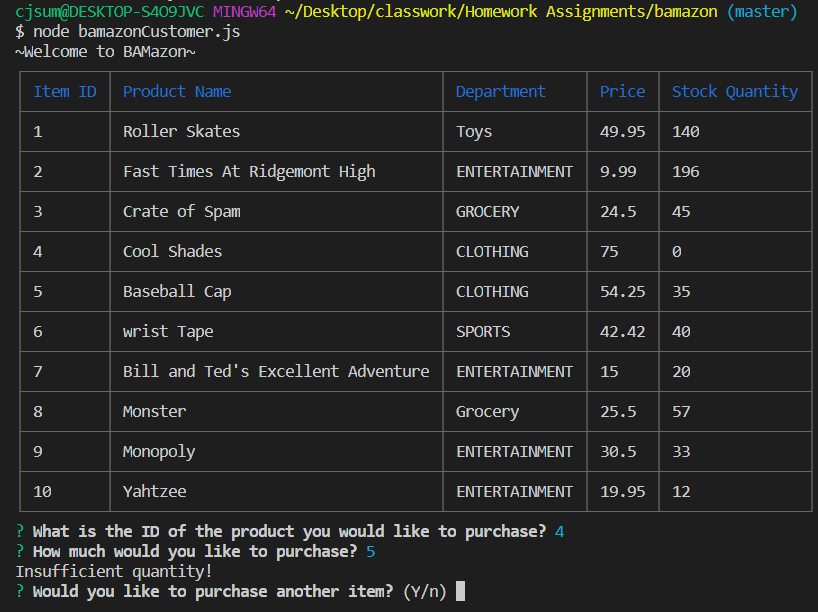

# BAMazon

<h3>What is BAMazon?</h3>
* BAMazon is an Amazon-like store front using Node.js and MySQL.

<h3>Getting Started</h3>
* Clone repo.
 
* Run command in Terminal or Gitbash 'npm install'
 
* Run command: 'npm bamazonCustomer.js'
 
* Run 'ctrl + c' to exit each mode

<h3>BamazonCustomer.js will ...</h3>
 
* Prints a list of products available in the store.
 
* Prompts customer which product they would like to purchase by ID number.
 

 
 
* Asks for the quantity.
 
* If there is a sufficient amount of the product in stock, it will return the total for that purchase.

 
 
* However, if there is not enough of the product in stock, it will tell the user that there is an Insufficent Quantity. 
 
* It will then ask the user if they would like to purchase another item.
* if 'Y' (yes) is chosen then it will repeat the prompts
 
* If "n" (no) is chosen then it will give the user a 'See You Soon!" response.
 

 
 
* If the purchase goes through, it updates the stock quantity to reflect the purchase.
 

<h3>Technology</h3>
* Node.js
 
* Inquire NPM Package (https://www.npmjs.com/package/inquirer)
 
* MYSQL NPM Package (https://www.npmjs.com/package/mysql)

 Prerequisites 
* Node.js 
 
* Create a MYSQL database called 'Bamazon', reference schema.sql

<h3>Built With<h3>
* MySQLWorkbench
 
* Terminal/Gitbash

<h3>Authors<h3>
 
* CJ Summers
